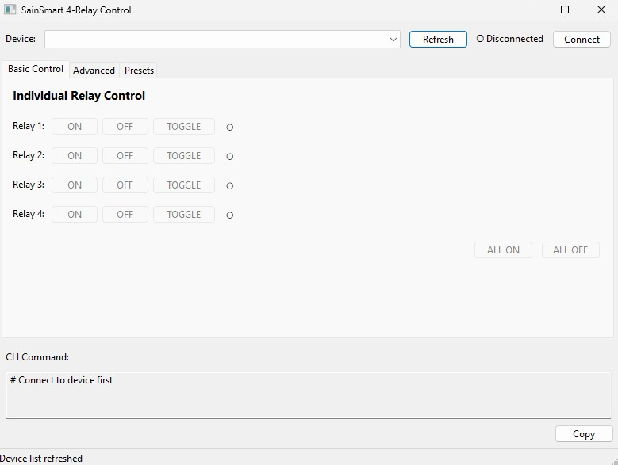

# SainSmart 4-Relay Control

A professional command-line and GUI application for controlling FTDI-based relay boards, specifically designed for the SainSmart 4-channel USB relay module.


## Features

### Dual Interface
- **GUI Mode**: User-friendly graphical interface with visual status indicators
- **CLI Mode**: Powerful command-line interface for automation and scripting

### Core Capabilities
- ✅ Individual relay control (ON/OFF/TOGGLE)
- ✅ Absolute state setting (set all relays at once)
- ✅ Momentary pulse with automatic state restoration
- ✅ Multiple relay operations in a single command
- ✅ Auto-detection of FTDI devices
- ✅ Comprehensive error handling with meaningful exit codes
- ✅ Robust logging system (console and file)
- ✅ Real-time relay state indicators

### Automation-Friendly
- Silent mode for batch files (`--quiet`)
- Standardized exit codes for error handling
- Device selection by serial number or index

## Screenshots

### GUI Mode

## Installation

### Prerequisites

- **Python 3.7 or higher**
- **Windows** (FTDI drivers and ftd2xx library are Windows-specific)
- **FTDI Drivers** installed ([Download here](https://ftdichip.com/drivers/d2xx-drivers/))

### Install Dependencies

```bash
# Core dependencies
pip install ftd2xx

# For GUI support (optional, CLI works without it)
pip install wxPython
```

## Quick Start

### GUI Mode

Simply run without arguments:
```bash
python sainsmart_ftdi_sainsmart_ftdi_relay_control.py
```

1. Select your device from the dropdown
2. Click **Connect**
3. Use the ON/OFF/TOGGLE buttons to control relays
4. Status LEDs show real-time relay states (● = ON, ○ = OFF)

### CLI Mode

#### List available devices:
```bash
python sainsmart_ftdi_relay_control.py --list-devices
```

#### Control relays:
```bash
# Turn on relays 1 and 2
python sainsmart_ftdi_relay_control.py --on 1 2

# Turn off relay 3
python sainsmart_ftdi_relay_control.py --off 3

# Toggle relay 4
python sainsmart_ftdi_relay_control.py --toggle 4

# Set absolute state (1 and 3 ON, 2 and 4 OFF)
python sainsmart_ftdi_relay_control.py --state 1 3

# Momentary pulse relay 2 for 2 seconds
python sainsmart_ftdi_relay_control.py --momentary 2 --duration 2.0

# Multiple operations in one command
python sainsmart_ftdi_relay_control.py --on 1 --off 2 --toggle 3
```
#### Or if compiled
````bash
# Turn on relays 1 and 2
sainsmart_ftdi_relay_control.exe --on 1 2

# Turn off relay 3
sainsmart_ftdi_relay_control.exe --off 3
````
#### Specify device (for multiple devices):
```bash
python sainsmart_ftdi_relay_control.py --device-serial A1B2C3D4 --on 1 2
python sainsmart_ftdi_relay_control.py --device-index 0 --on 1 2
```

#### Production/automation (quiet mode):
```bash
python sainsmart_ftdi_relay_control.py --device-serial A1B2C3D4 --quiet --on 1
```

## Command-Line Reference

### Device Selection
| Flag | Description |
|------|-------------|
| `--list-devices` | List all available FTDI devices |
| `--device-index INDEX` | Connect to device by index (0-based) |
| `--device-serial SERIAL` | Connect to device by serial number |

### Relay Commands
| Flag | Description |
|------|-------------|
| `--state RELAY [RELAY ...]` | Set absolute state (specified ON, others OFF) |
| `--on RELAY [RELAY ...]` | Turn on specified relays (leave others unchanged) |
| `--off RELAY [RELAY ...]` | Turn off specified relays (leave others unchanged) |
| `--toggle RELAY [RELAY ...]` | Toggle specified relays (leave others unchanged) |
| `--momentary RELAY [RELAY ...]` | Pulse relays, then restore previous state |
| `--duration SECONDS` | Duration for momentary pulse (default: 0.5s) |

**Note:** Relay numbers are 1-4 (matching physical board labels)

### Command Rules
- `--state` (`-s`) is mutually exclusive with `--on`, `--off`, `--toggle` (`-t`)
- `--on`, `--off`, `--toggle` can be combined (different relays)
- `--momentary` (`-m`) applies after other commands
- `--duration` (`-d`)only valid with `--momentary`

### Output Options
| Flag | Description |
|------|-------------|
| `--quiet`, `-q` | Suppress informational messages (errors still shown) |
| `--verbose`, `-v` | Show detailed execution information |
| `--log-file PATH` | Write logs to specified file |

### Configuration
| Flag | Description |
|------|-------------|
| `--config PATH` | Use custom settings XML file |
| `--help`, `-h` | Show help message |

## Exit Codes

For batch file integration:

| Code | Meaning |
|------|---------|
| 0 | Success |
| 1 | General error |
| 2 | No devices found |
| 3 | Specified device not found |
| 4 | Connection failed |
| 5 | Command execution failed |
| 6 | Invalid arguments |
| 7 | Device disconnected |
| 8 | Permission denied |
| 9 | Device in use by another application |
| 10 | Invalid relay number |
| 11 | Conflicting flags |
| 12 | FTDI driver error |

### Example Batch File with Error Handling

```batch
@echo off
sainsmart_ftdi_relay_control.exe --device-serial A1B2C3D4 --quiet --on 1 2

if errorlevel 1 (
    echo Failed to control relays! Error code: %errorlevel%
    exit /b 1
)

echo Relays activated successfully
```

## Building Standalone Executable

Create a single `.exe` file with PyInstaller:

Drag and drop the `sainsmart_ftdi_relay_control.py` file onto the `compile.bat` file.

## Hardware Compatibility

**Tested with:**
- SainSmart 4-Channel USB Relay Module
- FTDI FT245RL chip-based relay boards

**Should work with:**
- Any FTDI-based relay board supporting bit bang mode
- 1-8 relay boards (code easily adaptable)

### Contributing

Contributions are welcome! Please:

1. Fork the repository
2. Create a feature branch (`git checkout -b feature/amazing-feature`)
3. Commit your changes (`git commit -m 'Add amazing feature'`)
4. Push to the branch (`git push origin feature/amazing-feature`)
5. Open a Pull Request

## License

```
MIT License

Copyright (c) 2025 wolfdigitalsolutions

Permission is hereby granted, free of charge, to any person obtaining a copy
of this software and associated documentation files (the "Software"), to deal
in the Software without restriction, including without limitation the rights
to use, copy, modify, merge, publish, distribute, sublicense, and/or sell
copies of the Software, and to permit persons to whom the Software is
furnished to do so, subject to the following conditions:

The above copyright notice and this permission notice shall be included in all
copies or substantial portions of the Software.

THE SOFTWARE IS PROVIDED "AS IS", WITHOUT WARRANTY OF ANY KIND, EXPRESS OR
IMPLIED, INCLUDING BUT NOT LIMITED TO THE WARRANTIES OF MERCHANTABILITY,
FITNESS FOR A PARTICULAR PURPOSE AND NONINFRINGEMENT. IN NO EVENT SHALL THE
AUTHORS OR COPYRIGHT HOLDERS BE LIABLE FOR ANY CLAIM, DAMAGES OR OTHER
LIABILITY, WHETHER IN AN ACTION OF CONTRACT, TORT OR OTHERWISE, ARISING FROM,
OUT OF OR IN CONNECTION WITH THE SOFTWARE OR THE USE OR OTHER DEALINGS IN THE
SOFTWARE.
```

